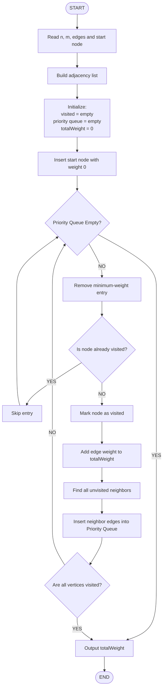
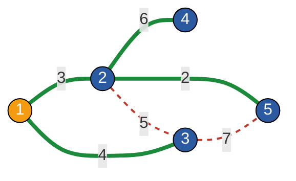

# Prim's (MST) : Special Subtree

This project is a Java solution to HackerRank's "Prim's (MST) : Special Subtree" problem. The program finds the total weight of the Minimum Spanning Tree of a weighted undirected graph using Prim's Algorithm, starting from a given vertex.

---

## Student Details

| Field | Details |
|---|---|
| Name | Kaaysha Rao |
| Registration Number | 2411021060775 |
| Course | Data Structures and Algorithms |
| Course Code | IE1ITC302 |
| Language | Java |
| Platform | HackerRank |

---

## Problem Statement

Given a weighted undirected graph, find a subgraph that:

- Contains all vertices.
- Has minimum total edge weight.
- Has exactly one path between any two vertices.

This is a **Minimum Spanning Tree (MST)**.

The solution uses **Prim's Algorithm** starting from a specified vertex.

**HackerRank Problem:** https://www.hackerrank.com/challenges/primsmstsub/problem

---

## Algorithm Used

### Prim's Algorithm

1. Start from the given vertex.
2. Mark it as visited.
3. Add its outgoing edges to a min-priority queue.
4. Select the smallest-weight edge.
5. If the destination vertex is unvisited, add it to the MST.
6. Add the edge weight to the total.
7. Add the new vertex's edges to the priority queue.
8. Repeat until all vertices are included.
9. Return the total MST weight.

---

## Data Structures Used

| Data Structure | Purpose |
|---|---|
| Adjacency List | Stores each vertex and its connected edges (neighbour and weight). |
| PriorityQueue | Works as a min-heap to obtain the smallest available edge. |
| HashSet | Stores visited vertices and prevents a vertex from being added repeatedly. |

---

## Flowchart



**Workflow in short:**
Input Graph → Build Adjacency List → Select Start Node → Initialize Priority Queue → Select Minimum Edge → Check Visited Status → Add Vertex → Add New Edges → Repeat → Calculate MST Weight → Output Result

---

## Graph



| Style | Meaning |
|---|---|
| Thick green line | MST Edge |
| Dashed red line | Non-MST Edge |
| Orange node | Start Node (1) |

The graph contains 5 vertices and 6 weighted edges.

Starting vertex = 1.

The MST contains four edges because a spanning tree with 5 vertices contains n - 1 = 4 edges.

- **MST edges:** 1–2 (3), 2–5 (2), 1–3 (4), 2–4 (6)
- **Non-MST edges:** 2–3 (5), 3–5 (7)

**Total MST Weight = 15**

---

## Example

### Sample Input (`sample/input.txt`)

```text
5 6
1 2 3
1 3 4
4 2 6
5 2 2
2 3 5
3 5 7
1
```

### Sample Output (`sample/output.txt`)

```text
15
```

### MST Selection

1. Start at vertex 1.
2. Select edge 1–2 with weight 3.
3. Select edge 2–5 with weight 2.
4. Select edge 1–3 with weight 4.
5. Select edge 2–4 with weight 6.

**Total = 3 + 2 + 4 + 6 = 15**

Edges 2–3 (weight 5) and 3–5 (weight 7) are not selected, because they would connect vertices that are already in the tree and form a cycle.

---

## Java Code (`src/Solution.java`)

```java
import java.io.*;
import java.util.*;

class Result {

    public static int prims(int n, List<List<Integer>> edges, int start) {

        // Build adjacency list
        Map<Integer, List<int[]>> graph = new HashMap<>();

        for (List<Integer> edge : edges) {
            int u = edge.get(0);
            int v = edge.get(1);
            int w = edge.get(2);

            graph.computeIfAbsent(u, k -> new ArrayList<>())
                 .add(new int[]{v, w});

            graph.computeIfAbsent(v, k -> new ArrayList<>())
                 .add(new int[]{u, w});
        }

        // Min-heap for edges (node, weight)
        PriorityQueue<int[]> pq =
            new PriorityQueue<>(Comparator.comparingInt(a -> a[1]));

        Set<Integer> visited = new HashSet<>();

        // Start Prim's Algorithm from the given node
        pq.add(new int[]{start, 0});

        int totalWeight = 0;

        while (!pq.isEmpty()) {

            int[] current = pq.poll();

            int node = current[0];
            int weight = current[1];

            // Ignore already visited nodes
            if (visited.contains(node)) {
                continue;
            }

            visited.add(node);
            totalWeight += weight;

            // Add edges leading to unvisited neighbors
            for (int[] neighbor :
                    graph.getOrDefault(node, new ArrayList<>())) {

                if (!visited.contains(neighbor[0])) {
                    pq.add(new int[]{neighbor[0], neighbor[1]});
                }
            }
        }

        return totalWeight;
    }
}

public class Solution {

    public static void main(String[] args) throws IOException {

        BufferedReader bufferedReader =
            new BufferedReader(new InputStreamReader(System.in));

        BufferedWriter bufferedWriter =
            new BufferedWriter(
                new FileWriter(System.getenv("OUTPUT_PATH")));

        String[] firstMultipleInput =
            bufferedReader.readLine()
                           .replaceAll("\\s+$", "")
                           .split(" ");

        int n = Integer.parseInt(firstMultipleInput[0]);
        int m = Integer.parseInt(firstMultipleInput[1]);

        List<List<Integer>> edges = new ArrayList<>();

        for (int i = 0; i < m; i++) {

            String[] edgeInput =
                bufferedReader.readLine()
                             .replaceAll("\\s+$", "")
                             .split(" ");

            List<Integer> edge = new ArrayList<>();

            for (String s : edgeInput) {
                edge.add(Integer.parseInt(s));
            }

            edges.add(edge);
        }

        int start =
            Integer.parseInt(bufferedReader.readLine().trim());

        int result = Result.prims(n, edges, start);

        bufferedWriter.write(String.valueOf(result));
        bufferedWriter.newLine();

        bufferedReader.close();
        bufferedWriter.close();
    }
}
```

---

## Complexity

**Time Complexity:** O((V + E) log V)

Each edge can be pushed into the priority queue, and every push/pop on the heap costs O(log V).

**Space Complexity:** O(V + E)

The adjacency list stores all vertices and edges, and the visited set and priority queue also grow with the graph size.

---

## How to Run

Save the Java code as `Solution.java` and compile it:

```bash
javac Solution.java
```

The program reads the graph from standard input and writes the answer to the file named in the `OUTPUT_PATH` environment variable (HackerRank format). Save the sample input as `input.txt`, then run:

```bash
# Linux / macOS
OUTPUT_PATH=result.txt java Solution < input.txt
cat result.txt
```

```powershell
# Windows PowerShell
$env:OUTPUT_PATH="result.txt"
Get-Content input.txt | java Solution
Get-Content result.txt
```

The result should be `15`.

---

## Result

The program calculates the minimum total weight of the spanning tree for the sample graph as:

**15**
