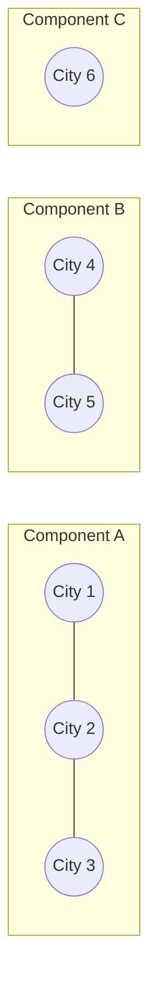
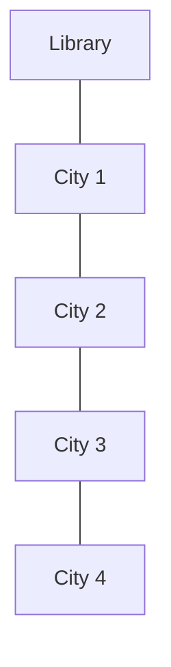
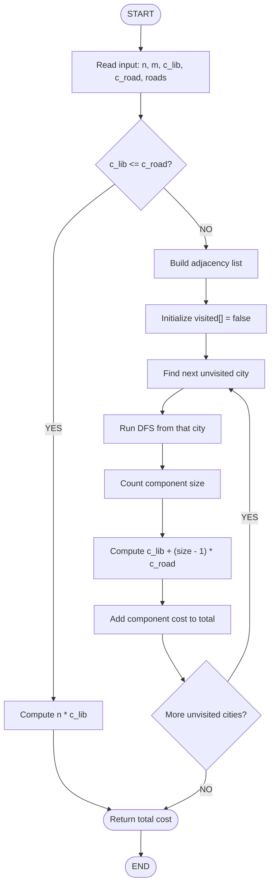
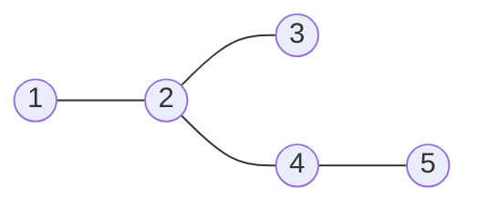
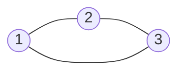
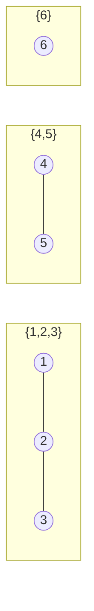
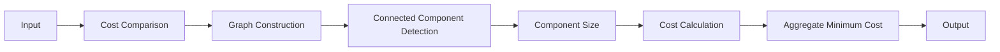

# Roads and Libraries

Graph connectivity and cost-minimization problem solved using DFS-based connected component analysis.

| Property | Details |
|----------|---------|
| Platform | HackerRank |
| Domain | Graph Theory |
| Algorithm | DFS |
| Technique | Connected Components |
| Language | C++ |
| Complexity | O(n + m) |
| Space | O(n + m) |

---

## Table of Contents

- [A. Problem Title](#roads-and-libraries)
- [B. Problem Statement](#b-problem-statement)
- [Graph Model](#graph-model)
- [Key Observation](#key-observation)
- [Spanning Tree Justification](#spanning-tree-justification)
- [E. Solution Steps / Algorithm](#e-solution-steps--algorithm)
- [Flowchart](#flowchart)
- [DFS Visualization](#dfs-traversal-visualization)
- [Pseudocode](#pseudocode)
- [Correctness](#correctness--why-the-algorithm-works)
- [Example Walkthrough](#example-walkthrough)
- [Second Example](#second-example-disconnected-graph)
- [Edge Cases](#edge-cases)
- [Complexity Analysis](#complexity-analysis)
- [Data Structures Used](#data-structures-used)
- [Why Iterative DFS](#why-iterative-dfs)
- [Technical Pipeline](#technical-pipeline)
- [C. Problem Link](#c-hackerrank--leetcode-link)
- [D. GitHub Repository](#d-students-github-link)
- [F. Code Developed](#f-code-developed)
- [Repository Structure](#repository-structure)
- [Summary](#final-technical-summary)

---

## B. Problem Statement

HackerLand consists of `n` cities, indexed from `1` to `n`. None of the cities currently have a library. The government wants to guarantee that every citizen has access to a library — either directly, by having a library built in their own city, or indirectly, through a network of roads connecting their city to one that has a library.

Roads can be constructed between certain pairs of cities from a given candidate list. Each road, once built, is bidirectional — it can be traversed in either direction. The task is to decide, for each test case, the minimum total cost required to guarantee library access for every city, given that building a library and building a road have different fixed costs.

**Input parameters**

| Symbol | Meaning |
|--------|---------|
| `n` | Total number of cities |
| `m` | Number of candidate roads |
| `c_lib` | Cost of constructing a single library |
| `c_road` | Cost of constructing a single road |
| `cities[i]` | A pair `(u, v)` representing a candidate road between city `u` and city `v` |

**Output**

A single integer representing the minimum cost required so that every city has library access, either directly or through a chain of roads.

**Constraints (as per problem statement)**

- `1 ≤ n ≤ 10^5`
- `1 ≤ m ≤ min(n·(n-1)/2, 10^5)`
- `1 ≤ c_lib, c_road ≤ 10^5`
- Road endpoints are valid city indices, `u ≠ v`

The statement above is a rewritten technical restatement of the original HackerRank problem, not a verbatim copy of the platform's wording.

---

## Graph Model

The problem translates directly into a graph connectivity problem once the following mapping is made:

| Real-world entity | Graph entity |
|--------------------|--------------|
| City | Vertex |
| Road | Undirected edge |
| Group of mutually reachable cities | Connected component |
| Library | Accessibility source within a component |

Once a library exists in one city of a connected component, every other city in that same component can reach it by traveling along roads, regardless of how many hops are required. This means access is a **component-level** property, not a per-city property.



City 6 has no candidate roads connecting it to any other city, so it forms its own singleton component. Component A and Component B are internally connected but mutually unreachable, since no road links the two subgraphs.

Because each connected component is independent of the others in terms of accessibility, the total cost can be computed **per component** and then summed — a property exploited directly in the algorithm.

---

## Key Observation

The problem reduces to comparing two competing strategies at the component level.

**Case 1 — `c_lib ≤ c_road`**

If a library is cheaper than or equal in cost to a road, there is no scenario where building a road is worth it — building a library in every city is always at least as cheap as connecting cities together. Roads become redundant.

```
Minimum Cost = n × c_lib
```

**Case 2 — `c_road < c_lib`**

When roads are strictly cheaper, it becomes economical to build exactly **one** library per connected component and connect the remaining cities in that component using roads, rather than paying the library cost repeatedly.

For a connected component containing `k` cities:

```
Cost(component) = c_lib + (k - 1) × c_road
```

The `(k - 1)` term is not arbitrary — it is the minimum number of edges required to keep `k` vertices connected, which leads directly to the spanning tree argument below.

---

## Spanning Tree Justification

A connected component with `k` cities requires **at least** `k - 1` roads to keep all of them mutually reachable. Using more than `k - 1` roads within a component adds redundant connectivity (cycles) without reducing the number of libraries needed, so it never improves the cost. Using fewer than `k - 1` roads necessarily disconnects at least one city, forcing an additional library. Hence `k - 1` is both necessary and sufficient — this is precisely the definition of a spanning tree over the component.



`k` cities → 1 library → `k - 1` roads → full accessibility within the component, at minimum cost.

---

## E. Solution Steps / Algorithm

1. **Read the test case** — parse `n`, `m`, `c_lib`, `c_road`, and the list of candidate roads.
2. **Compare `c_lib` and `c_road`** — this comparison determines which branch of the algorithm applies, before any graph traversal is performed.
3. **Handle `c_lib ≤ c_road` directly** — if true, return `n × c_lib` immediately; no graph construction is necessary in this branch.
4. **Build the adjacency list** — for the `c_road < c_lib` branch, convert the edge list into an adjacency representation for O(1) neighbor lookups.
5. **Initialize a visited array** — sized `n + 1`, all entries initially `false`.
6. **Iterate over all cities from 1 to n.**
7. **Start DFS from every unvisited city** — each unvisited city marks the start of a new, previously undiscovered component.
8. **Count the component size** — the DFS traversal returns the number of vertices reachable from the starting city.
9. **Calculate the component cost** using `c_lib + (size - 1) × c_road`.
10. **Add the component cost to the running total.**
11. **Return the accumulated total** once all cities have been visited.

---

## Flowchart



---

## DFS Traversal Visualization



Starting DFS at city `1`, one possible traversal order is:

```
Visit 1 → Visit 2 → Visit 3 → Visit 4 → Visit 5
```

This order depends on the adjacency list's internal ordering and is shown here as one representative example — a different adjacency construction could produce a different visitation sequence while still discovering the same five vertices. Regardless of order, the component size resolves to `5`.

---

## Pseudocode

```
FUNCTION roadsAndLibraries(n, c_lib, c_road, cities)

    IF c_lib <= c_road
        RETURN n * c_lib

    BUILD adjacency list FROM cities

    visited = ARRAY of size (n + 1), all FALSE
    total_cost = 0

    FOR city FROM 1 TO n
        IF visited[city] == FALSE
            component_size = DFS(city, adjacency, visited)

            total_cost += c_lib + (component_size - 1) * c_road

    RETURN total_cost


FUNCTION DFS(start, adjacency, visited)

    stack = EMPTY STACK
    PUSH start ONTO stack
    count = 0

    WHILE stack is NOT EMPTY
        node = POP stack

        IF visited[node] == FALSE
            visited[node] = TRUE
            count += 1

            FOR neighbor IN adjacency[node]
                IF visited[neighbor] == FALSE
                    PUSH neighbor ONTO stack

    RETURN count
```

---

## Correctness / Why the Algorithm Works

1. **Every connected component needs at least one library.** A city with no library and no road-path to a library has no way to reach one, so accessibility fails unless every component contains at least one library.
2. **`k - 1` roads are sufficient for `k` connected cities.** A spanning tree over `k` vertices uses exactly `k - 1` edges and guarantees a path between any two vertices in the component, which is sufficient for every city to reach the single library.
3. **Adding libraries beyond one per component is unnecessary when roads are cheaper.** Since `c_road < c_lib` in this branch, replacing a road with an additional library can only increase cost, never decrease it.
4. **Processing components independently yields the global optimum.** Since no road exists between separate components, decisions made in one component (library placement, road usage) have zero effect on the cost of any other component. Minimizing each component's cost independently therefore minimizes the sum over all components, which is the global objective.

---

## Example Walkthrough

**Input**

```
n = 3, m = 3
roads = [(1,2), (2,3), (1,3)]
c_lib = 2, c_road = 1
```



Since `c_road (1) < c_lib (2)`, the component-based strategy applies. All three cities form a single connected component of size `3`.

```
Cost = c_lib + (3 - 1) × c_road
     = 2 + 2 × 1
     = 4
```

Building a library in every city instead would cost `3 × 2 = 6`, which is strictly worse. The component-based strategy correctly identifies `4` as the minimum.

---

## Second Example (Disconnected Graph)

```
Components: {1, 2, 3}, {4, 5}, {6}
c_lib = 3, c_road = 1
```



| Component | Size | Cost formula | Cost |
|-----------|------|---------------|------|
| {1, 2, 3} | 3 | `c_lib + 2 × c_road` | `3 + 2 = 5` |
| {4, 5} | 2 | `c_lib + 1 × c_road` | `3 + 1 = 4` |
| {6} | 1 | `c_lib` | `3` |

```
Total = 5 + 4 + 3 = 12
```

---

## Edge Cases

| Edge Case | Expected Strategy |
|-----------|-------------------|
| `n = 1` | One library, no roads possible or needed |
| `m = 0` | No candidate roads exist; a library must be built in every city |
| `c_lib < c_road` | Library in every city dominates any road-based strategy |
| `c_lib = c_road` | Library in every city is optimal (roads offer no cost advantage) |
| `c_road < c_lib` | Component-based strategy: one library per component plus spanning roads |
| Fully connected graph | Single component: one library + `(n - 1)` roads |
| Multiple disconnected components | One library per component, computed independently |

---

## Complexity Analysis

Let `n` be the number of cities and `m` be the number of candidate roads.

**Graph construction**

Each edge is inserted into the adjacency list once (twice, for both directions of the undirected edge):

```
O(m)
```

**DFS traversal across all components**

Every vertex is pushed and popped from the stack exactly once across the entire run (guarded by the `visited` check), and every edge is examined at most twice — once from each endpoint:

```
O(n + m)
```

**Overall**

| Phase | Time | Space |
|-------|------|-------|
| Adjacency list construction | O(m) | O(n + m) |
| DFS over all cities | O(n + m) | O(n) (visited array + stack) |
| **Total** | **O(n + m)** | **O(n + m)** |

Each city is visited at most once due to the `visited` array, and each edge is examined a constant number of times during traversal, so the overall traversal cost is linear in the size of the graph.

`long long` is used for cost accumulation because, under the given constraints (`n, c_lib, c_road` up to `10^5`), the total cost can exceed the range representable by a 32-bit `int`.

---

## Data Structures Used

| Data Structure | Purpose |
|------------------|---------|
| `vector<vector<int>>` | Adjacency list representation of the graph |
| `vector<bool>` | Visited-state tracking per city |
| `stack<int>` | Explicit stack for iterative DFS |
| `long long` | Accumulating total cost without overflow |

---

## Why Iterative DFS?

The implementation uses an explicit stack rather than recursive function calls for DFS. For components with a large number of cities, recursive DFS can approach the limits of the call stack depending on the runtime environment. Using an explicit stack avoids this dependency and keeps memory usage under direct control. This is a practical implementation choice for the given constraints rather than a fundamental algorithmic requirement.

---

## Technical Pipeline



---

## C. HackerRank / LeetCode Link

**Problem:** Roads and Libraries
**Platform:** HackerRank
**Link:** [Roads and Libraries — HackerRank](https://www.hackerrank.com/challenges/torque-and-development/problem)

---

## D. Student's GitHub Link

[GitHub Repository](PASTE_YOUR_GITHUB_LINK_HERE)

The repository linked above contains:

- This `README.md`
- The C++ source code (`roads_and_libraries.cpp`)
- A supporting report/documentation file

---

## F. Code Developed

The solution is implemented in C++ and follows the algorithm described in the sections above. Key implementation characteristics:

- Graph represented using an adjacency list (`vector<vector<int>>`)
- Connected components identified using **iterative DFS** (explicit `stack<int>`, no recursion)
- Component size and cost computed inline during traversal
- `long long` used throughout cost accumulation to avoid integer overflow
- Multiple test cases handled in a loop, each processed independently
- Fast I/O (`ios_base::sync_with_stdio(false); cin.tie(NULL);`) used to handle large input sizes within time limits

The full source code is not reproduced in this README. It is available separately in this repository as:

```
roads_and_libraries.cpp
```

---

## Repository Structure

```
Roads-and-Libraries/
│
├── README.md
├── roads_and_libraries.cpp
└── report/
    └── Roads_and_Libraries_Report.pdf
```

| File | Description |
|------|--------------|
| `README.md` | This document — problem explanation, algorithm, and analysis |
| `roads_and_libraries.cpp` | C++ implementation of the solution |
| `report/Roads_and_Libraries_Report.pdf` | Supporting written report/documentation |

---

## Final Technical Summary

```
Problem
  → Graph Modeling
    → Cost Comparison (c_lib vs c_road)
      → Connected Component Detection (DFS)
        → Spanning Tree Principle (k - 1 roads per component)
          → Minimum Cost Aggregation
```
